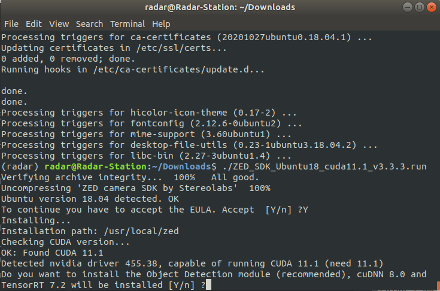
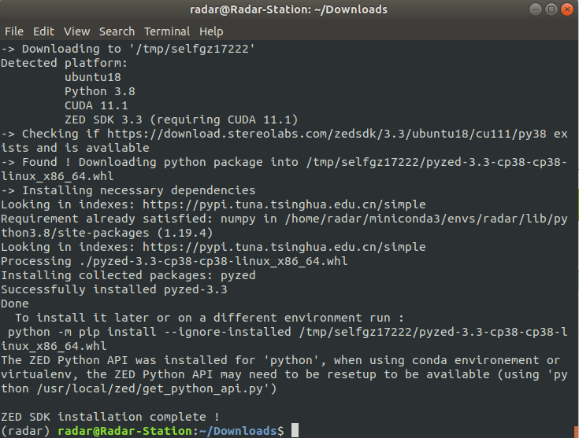

## Download and Install the ZED SDK

[SDK传送门](https://www.stereolabs.com/docs/installation/linux/)

### Setup CUDA Toolkit

之前在`software & updates`安装的只是**Driver**，所以我们还需要`Toolkit`，这点要明白

所以我们就去[NVIDIA官网](https://developer.nvidia.com/cuda-11.1.0-download-archive?target_os=Linux&target_arch=x86_64&target_distro=Ubuntu&target_version=1804&target_type=deblocal)整了一份，手动进行安装，建议手动，ZED里虽然有但不是很推荐。

```shell
wget https://developer.download.nvidia.com/compute/cuda/repos/ubuntu1804/x86_64/cuda-ubuntu1804.pin
sudo mv cuda-ubuntu1804.pin /etc/apt/preferences.d/cuda-repository-pin-600
wget https://developer.download.nvidia.com/compute/cuda/11.1.0/local_installers/cuda-repo-ubuntu1804-11-1-local_11.1.0-455.23.05-1_amd64.deb
sudo dpkg -i cuda-repo-ubuntu1804-11-1-local_11.1.0-455.23.05-1_amd64.deb
sudo apt-key add /var/cuda-repo-ubuntu1804-11-1-local/7fa2af80.pub
sudo apt-get update
sudo apt-get -y install cuda
```

上头为安装示例

- Run the ZED SDK installer.



识别成功CUDA～



成功完成安装，忙活到此完毕，简单庆祝，之后继续搬砖