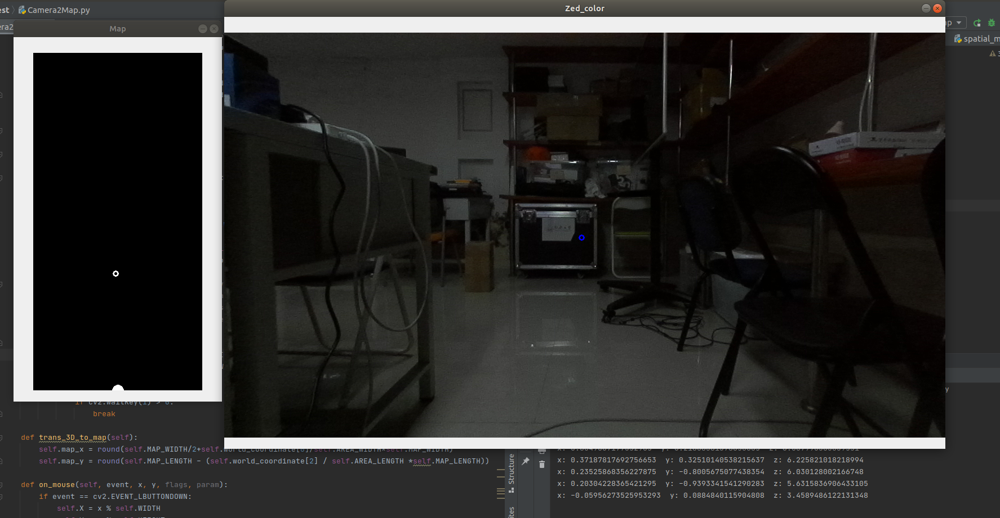
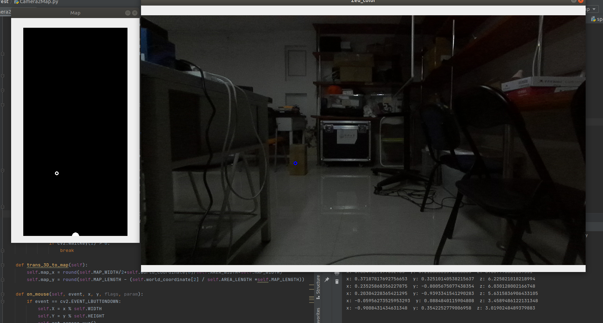
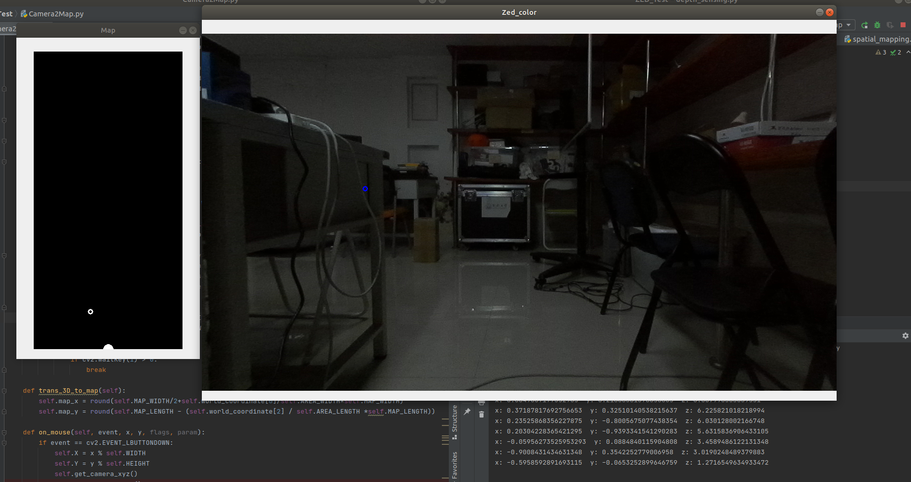

## 本周进展

#### ZED环境的搭建

#### 初步尝试ZED相机

- 成功获取到了物体在相机坐标系中的坐标
- 成功将相机坐标系中的位置转换到地图上

- 成功建立了10*5（m）的场地的模拟

  相机处于宽5m的中央，场地的一侧

  结果展示如下

  

  

  

#### 代码

```python
import pyzed.sl as sl
import numpy as np
import cv2


class Camera:
    # Picture Window size
    WIDTH = 1280
    HEIGHT = 720
    # Map sence
    MAP_WIDTH = 300
    MAP_LENGTH = 600
    # Real sense
    AREA_LENGTH = 10
    AREA_WIDTH = 5

    def __init__(self):
        # Create a Camera object
        self.zed = sl.Camera()

        # Create a InitParameters object and set configuration parameters
        init_params = sl.InitParameters()
        init_params.depth_mode = sl.DEPTH_MODE.PERFORMANCE  # Use PERFORMANCE depth mode
        init_params.coordinate_units = sl.UNIT.METER  # Use meter units (for depth measurements)
        init_params.camera_resolution = sl.RESOLUTION.HD720

        # Open the camera
        err = self.zed.open(init_params)
        if err != sl.ERROR_CODE.SUCCESS:
            exit(1)

        # Create and set RuntimeParameters after opening the camera
        self.runtime_parameters = sl.RuntimeParameters()
        self.runtime_parameters.sensing_mode = sl.SENSING_MODE.STANDARD  # Use STANDARD sensing mode
        # Setting the depth confidence parameters
        self.runtime_parameters.confidence_threshold = 100
        self.runtime_parameters.textureness_confidence_threshold = 100

        # present frame data
        self.image_frame = sl.Mat()

        # present depth frame data
        self.depth_frame = sl.Mat()

        # present color frame data
        self.point_cloud = sl.Mat()

        # present color numpy array
        self.color_image = None

        # present depth numpy array
        self.depth_image = None

        # The present xyz of the point
        self.world_coordinate = None

        # record the position of mouse on the small map
        self.map = np.zeros([self.MAP_LENGTH, self.MAP_WIDTH])
        self.map_x = 0
        self.map_y = 0

        # present mouse position
        self.X = self.WIDTH // 2
        self.Y = self.HEIGHT // 2

        # present distance
        self.dist = 0.0

    def get_camera_xyz(self):
        err, self.world_coordinate = self.point_cloud.get_value(self.X, self.Y)

        # Print the point's world coordinate
        print("x:", self.world_coordinate[0], " y:", self.world_coordinate[1], " z:", self.world_coordinate[2])

    def step_capture(self):
        # Retrieve left image
        self.zed.retrieve_image(self.image_frame, sl.VIEW.LEFT)
        # Retrieve depth map. Depth is aligned on the left image
        self.zed.retrieve_measure(self.depth_frame, sl.MEASURE.DEPTH)
        # Retrieve colored point cloud. Point cloud is aligned on the left image.
        self.zed.retrieve_measure(self.point_cloud, sl.MEASURE.XYZRGBA)

        # Get the data of the color frame and depth frame
        self.color_image = self.image_frame.get_data()
        self.depth_image = self.depth_frame.get_data()


    def capture(self):
        while True:
            if self.zed.grab(self.runtime_parameters) == sl.ERROR_CODE.SUCCESS:
                self.step_capture()

                # Show images
                cv2.namedWindow('Zed_color', cv2.WINDOW_AUTOSIZE)
                cv2.setMouseCallback('Zed_color', self.on_mouse)
                cv2.circle(self.color_image, (self.X, self.Y), 4, (255, 0, 0), 2)
                cv2.imshow('Zed_color', self.color_image)

                # cv2.namedWindow('Zed_depth', cv2.WINDOW_AUTOSIZE)
                # cv2.setMouseCallback('Zed_depth', self.on_mouse)
                # cv2.circle(self.depth_image, (self.X, self.Y), 4, (255, 0, 0), 2)
                # cv2.imshow('Zed_depth', self.depth_image)

                # Show Map
                cv2.circle(self.map, (self.MAP_WIDTH//2,self.MAP_LENGTH), 5, (255, 255, 255), 10)
                cv2.namedWindow('Map', cv2.WINDOW_AUTOSIZE)
                cv2.imshow('Map', self.map)

                if cv2.waitKey(1) > 0:
                    break

    def trans_3D_to_map(self):
        self.map_x = round(self.MAP_WIDTH / 2 + self.world_coordinate[0] / self.AREA_WIDTH * self.MAP_WIDTH)
        self.map_y = round(self.MAP_LENGTH - (self.world_coordinate[2] / self.AREA_LENGTH * self.MAP_LENGTH))

    def on_mouse(self, event, x, y, flags, param):
        if event == cv2.EVENT_LBUTTONDOWN:
            # Get the point's position in picture
            self.X = x % self.WIDTH
            self.Y = y % self.HEIGHT
            # Get the point coordinate in camera world
            self.get_camera_xyz()
            # Transform coordinate in 3D world to map
            self.trans_3D_to_map()
            # Get map mat
            self.get_map()

    def get_map(self):
        self.map = np.zeros([self.MAP_LENGTH, self.MAP_WIDTH])
        cv2.circle(self.map, (self.map_x, self.map_y), 4, (255, 0, 0), 2)

if __name__ == '__main__':
    camera = Camera()
    camera.capture()
```

