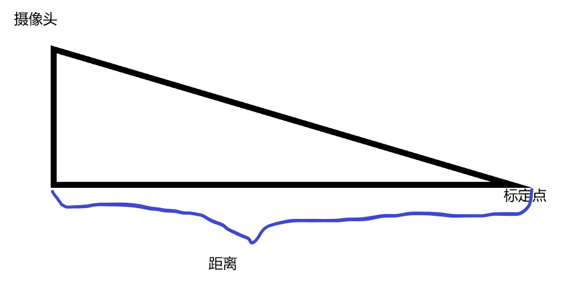
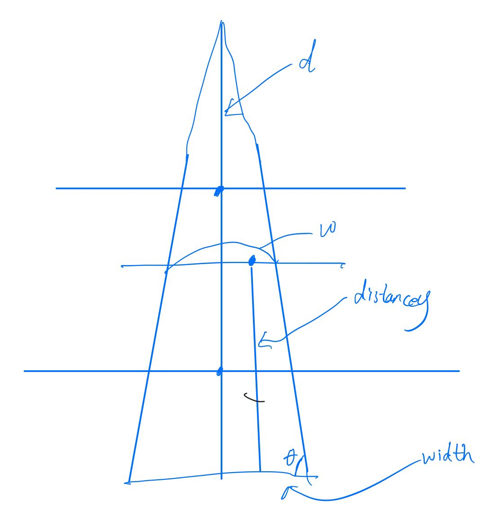
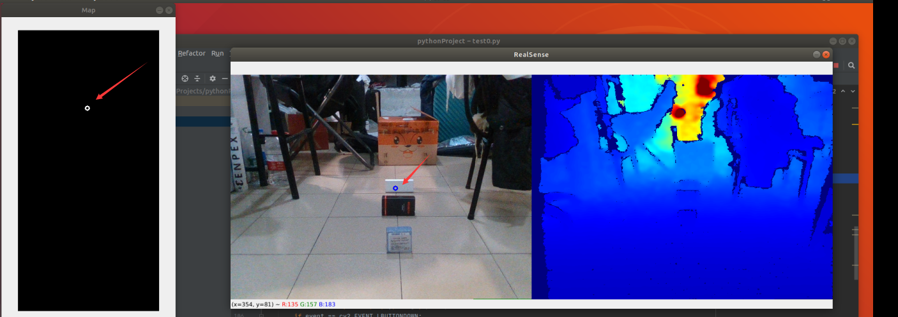
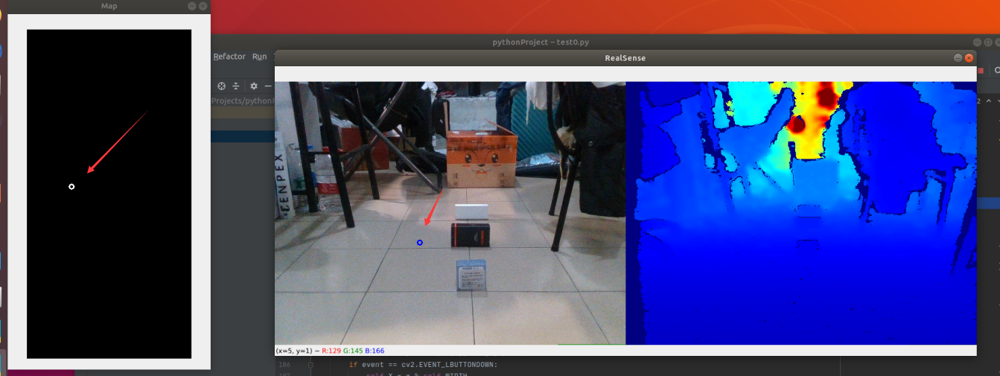
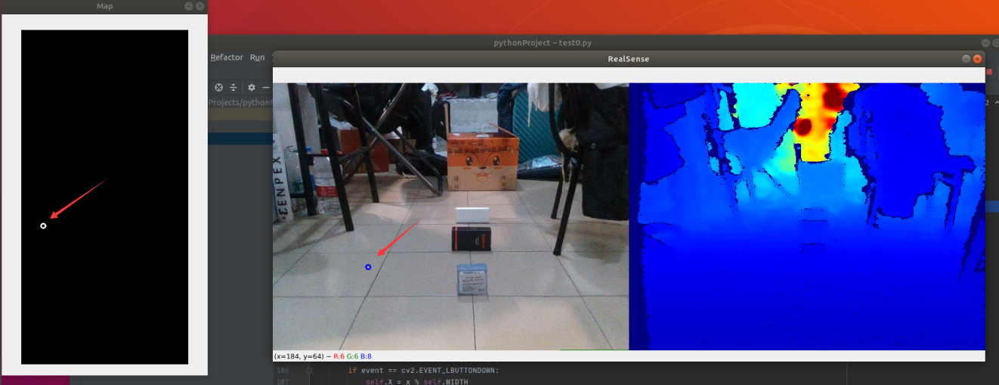

1、使用pyrealsense2，初步实现实现指定点在小地图上的位置。

2、主要工作为，通过摄像头所得到的图像以及深度，然后选择图上的一个点，通过一定算法的运算，得到它在小地图上的坐标。

3、初步算法的构想：

1）标定：通过标定图像上的两个中线上的点，从而得到图像上点的纵坐标和该点离摄像头的所在平面的距离的关系。得，当纵坐标为y1时，距离为a，纵坐标为y2时，距离为b。

2）选择点，得到点在图像上的坐标，以及该点离摄像头的距离

3）通过标定所得数据，计算所选点的上述图中的距离。具体算法如下所示：

- 计算图像上的点到对应线段中点的偏移
  $$
  dx = X - \frac{top.x+down.x}{2}
  $$

- 计算所选取的点的对应线段宽度w与基准线段width（实际宽度）之间的转换比例dw

  根据相似三角形
  $$
  \frac{w}{width}=\frac{distancey}{d}
  $$

  $$
  w=width - 2 * \frac{distancey}{tan\theta}
  $$

  $$
  dw = \frac{width}{d * w}*distancey
  $$

  计算实际宽度与图像宽度的转换比例
  $$
  width * k = map.width
  $$

- 根据偏移以及对应的转换比例求得地图上的对应位置
  $$
  map.x = \frac{map.width}{2} + dx*dw*k
  $$

- 当摄像头角度固定时，θ和d为常量，但是由于计算θ和d的计算不易，因此简化关系式（存在一定误差）,此时map.x可以简化为关于distancey的一次关系式，可以通过α的设定来进行对应的计算
  $$
  map.x = \frac{map.width}{2} + dx * distancey * \alpha
  $$

2、遇到的问题：

1）摄像头本身的精度会造成一定程度上的偏差

2）算法不够好，在许多地方进行了估算或者去除某些影响参数的干扰等操作。如，我们假定物体的高度为0，或者说选取的点必须是物体的最下方的点；其次我们的算法在计算某些值的表达式时，由于缺少某些数据，我们对于表达式的一些比例系数进行了估计，是一个不准确的值。

上述两个问题导致我们在计算物体坐标时，产生了一定的误差。

3、算法结果图：

